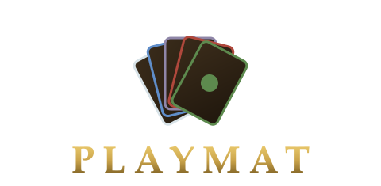

<p align="center">
  
</p>

# Playmat

A shared virtual table for paper-style Magic: The Gathering. Load a deck, share a
5-letter room code, and push cards around a table that syncs to everyone in the
room. The table is dumb; the players are smart — no rules engine, no accounts,
scale-to-zero AWS backend.

Powered by [mtg-crucible](https://github.com/domainellipticlanguage/mtg-crucible):
every card face on the table is crucible's `MtgCard` React component, custom
tokens are drawn in-browser by its render engine on every client (only JSON goes
over the wire), and flip/transform/battle orientations come from its
`computeRotations`.

<!-- Gameplay screenshot goes here so people know what to expect:

-->

Requirements & design doc: [docs/REQUIREMENTS.md](docs/REQUIREMENTS.md).

## Quick start (local, no AWS)

```bash
npm install
npm run dev
```

- Web app: http://localhost:5173 (vite, host-exposed for LAN/phone testing)
- Local backend: http://localhost:8787 — one Node process that serves the room
  API **and speaks the AppSync Events WebSocket protocol verbatim**, so the
  browser client has a single code path for dev and prod. Faithful in-order
  delivery; no artificial faults.
- Everything is same-origin through the vite proxy, so
  `ssh -R 80:localhost:5173 localhost.run` (or any tunnel of :5173) carries the
  whole app for remote/phone testing.

Open two browser windows, create a room in one, join with the code in the other.

## Deploy to AWS

```bash
npm run deploy       # cdk deploy → vite build w/ real endpoints → s3 sync → CF invalidation
node scripts/smoke-aws.mjs   # protocol smoke test against the deployed stack
```

One CDK stack (`Playmat`, us-east-1): AppSync Events API (Lambda authorizer +
IAM), two channel namespaces, two DynamoDB tables (TTL-cleaned), a room Lambda
behind a Function URL, S3 + CloudFront for the SPA. Idle cost ≈ $0; DynamoDB
and AppSync are on-demand.

The JWT signing key is generated on first synth into `infra/.jwt-key`
(gitignored). Keep it; redeploys reuse it so live room tokens survive.

## How sync works (the short version)

- Two channels per room: `/state/{code}` (committed actions; persisted) and
  `/ephemeral/{code}` (cursors + in-flight drags; throttled client-side,
  default 8/s, adjustable in ⚙ prefs; never persisted).
- Transport is at-most-once, unordered. Every state event carries **absolute
  values** and a per-subject sequence number; clients discard stale seqs
  (ties broken deterministically by publisher id). A dropped event is corrected
  by the next event for that subject.
- The `state` namespace's onPublish handler batch-writes each event's subject
  item to the Board table (one item per card/player/subject, 72h TTL) *before*
  fan-out — so join/reconnect is "fetch snapshot, then apply live events",
  never event replay.
- Every physical card gets a guid at import (27 Forests → 27 guids). The
  resolved pool (guid → card data) is broadcast once and persisted; afterwards
  events refer to guids only.
- Hidden zones (library order, hand) live in the owner's browser + localStorage,
  persisted server-side only for reconnect, and delivered only in the owner's
  snapshot. Nothing about peeks/scries is broadcast. Shuffles happen client-side
  (trust-based, per the design doc).
- "New game" mints a fresh `gameId`; board items from old epochs are filtered
  out of snapshots and client state (no mass deletes needed). Deck re-imports
  mint an `importId` that atomically replaces the player's pool.

## What's implemented

Rooms (create/join/rejoin with reserved seats/spectators for 5th+), decklist
paste + Archidekt URL import (commander inference from `// Commander`, `*CMDR*`,
`[Commander]` category, or manual pick; a clean resolve auto-chooses the deck),
saved decks with commander-art thumbnails, Scryfall resolution via
`/cards/collection` (75 cards/request, client-side), opening-hand modal with
London mulligan (keep/mull, bottom the extras), all six zones per player,
drag/multi-select/click-to-tap (shift+click multiselect; Figma-style pan/pinch
table gestures), a hand that behaves like physical cards (drag to reorder,
neighbors part to make room, one card — no ghost doubles), transform & flip &
battle rotations via mtg-crucible (`computeRotations`; battles enter sideways),
face-down/morph, arbitrary card counters + effective P/T, tokens (Scryfall
search, quick picks, custom tokens rendered in-browser by crucible on every
client; copy-as-token gets a proper token frame, and tokens cease to exist when
they leave the battlefield), life ±1/±5, commander damage that ticks life,
poison/energy/experience, shared d6/d20/dN/coin with synced animation,
decorative turn marker + take-turn shortcut (untap-all + draw), scry/surveil/
peek with reorder, search library (auto-shuffle on close), mill (Archidekt-style
submenu, yours or a peer's library), play-with-top-revealed, reveal-from-hand,
teaching mode ("show my hand to the table"), right-click context menus on every
surface (cards, hand, piles, library, battlefield background), per-player
playmats (seat-color pattern, commander art crop, or custom URL), event log,
per-seat table rotation with optional face-all-cards-toward-me, hover card
preview, connectivity status in the player trays + remote cursors, board reset
with confirmation, phone-friendly layout (touch drags on every surface,
tap-to-expand collapsed trays), keyboard shortcuts (D draw, U untap, T tap,
N select all mine — plus hover-targeted: M mills the library under the cursor,
P plays the hovered hand card, shift for face down).

## Testing

```bash
npm test                      # shared parser/protocol units + local-server e2e
npm run test:mobile           # phone-viewport smoke w/ real touch input (needs `npm run dev` up)
node scripts/smoke-aws.mjs    # against the deployed stack
```

The mobile smoke drives headless Chromium at Pixel dimensions and dispatches
CDP touch events, so Chrome runs its real gesture arbitration — a drag that
only works with a mouse fails here.

The e2e test spawns the real local server and drives two WebSocket clients
through join → import → play → tap-by-opponent → snapshot → re-import →
new-game filtering → rejoin → spectator rejection.

## Repo layout

```
shared/        wire protocol, decklist parser, board/snapshot assembly, JWT
web/           React SPA (vite). MtgCard from mtg-crucible renders the cards.
local-server/  dev backend: room API + AppSync Events wire-protocol emulation
infra/         CDK stack, Lambdas (room API, authorizer), APPSYNC_JS handlers
scripts/       deploy.mjs, smoke-aws.mjs, gen-art.mjs (Replicate art)
art/           logo candidates + generated table art
docs/          the original requirements/design doc
```

## Notable deviations & accepted limitations

- **Channel paths** are `/state/{code}` and `/ephemeral/{code}` (namespace must
  be the first segment in AppSync Events; the doc's `/game/{code}/...` shape
  isn't possible).
- **No private channel** — hidden info never leaves the owner's browser except
  to the snapshot store (deliberate; see §7.3 of the design doc).
- **Deck pools are readable by peers' devtools** (the pool broadcast includes
  your decklist). Same trust model as §7.3; library *order* and hand contents
  are never broadcast.
- **DDB is last-writer-wins per subject.** Two players mutating the same card in
  the same instant can briefly disagree in a later snapshot; the next event for
  that card corrects it. Live clients converge via seq + deterministic
  tie-break.
- **Moving a card into an offline player's library** parks a public marker;
  the owner's client folds it into their (hidden) library order when they're
  next online. Everyone else just sees the count.
- **Log entries** persist with the board (72h TTL), capped client-side at 500.
- Commander tax is a `tax` counter on the commander card in the command zone
  (double it for the cost bump).
